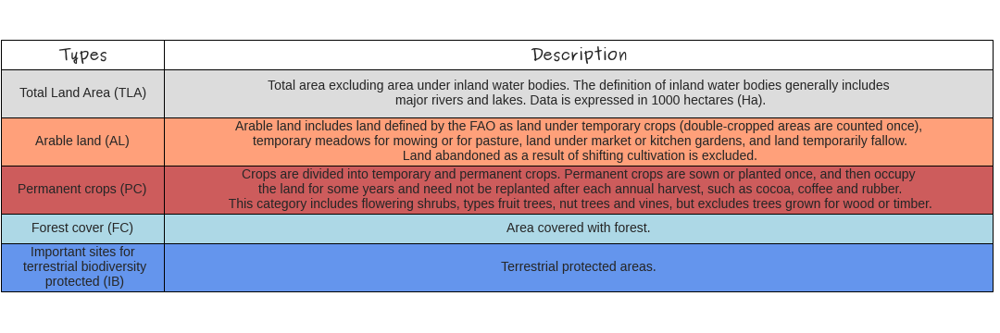
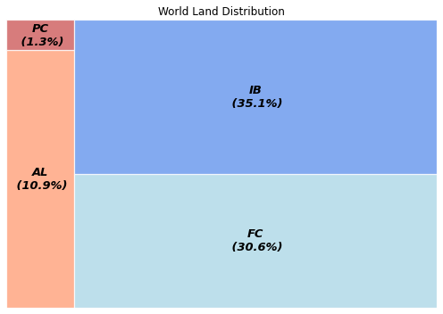
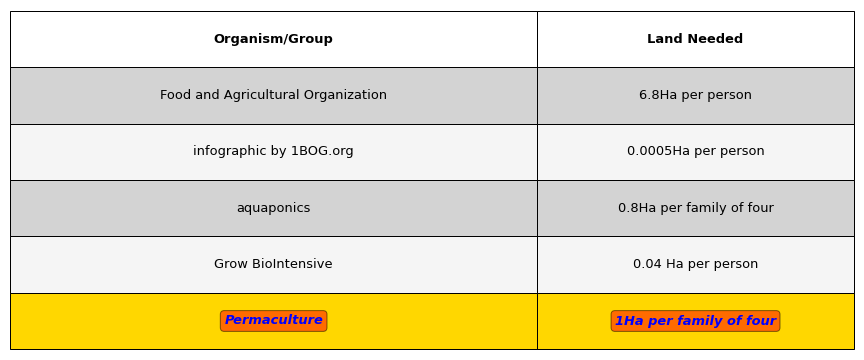
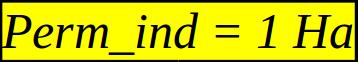
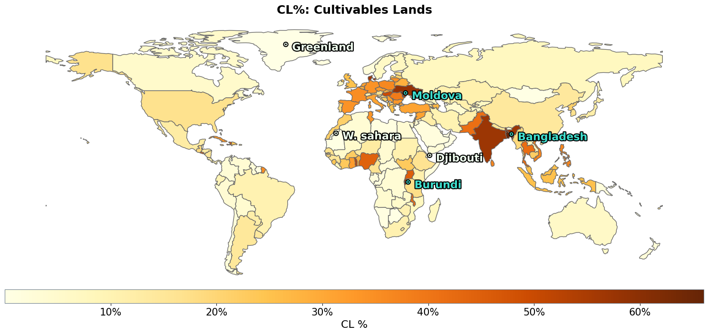
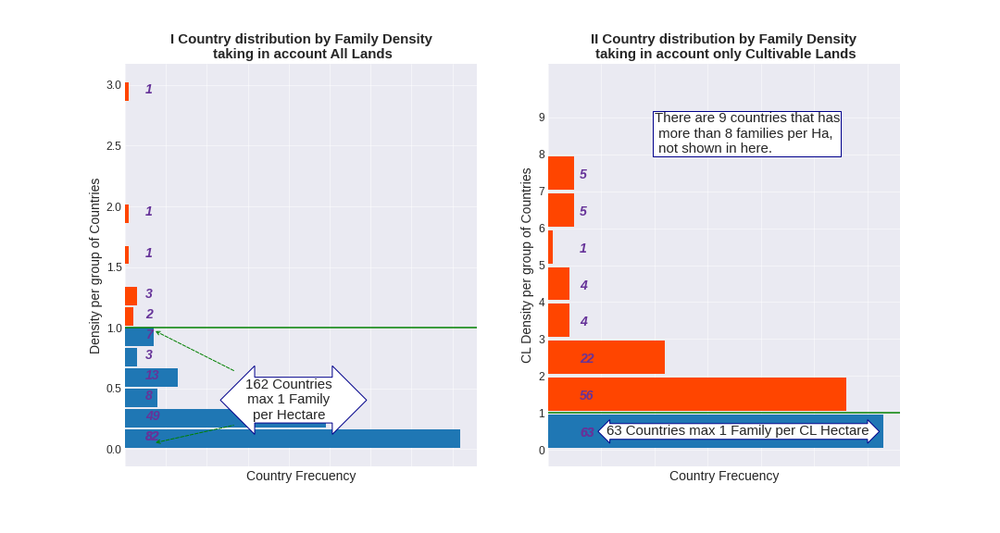
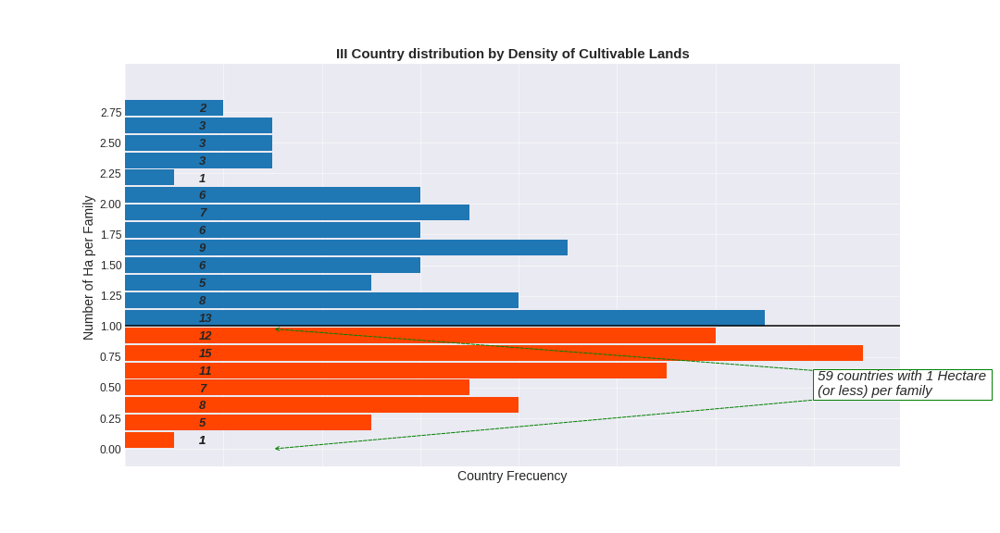
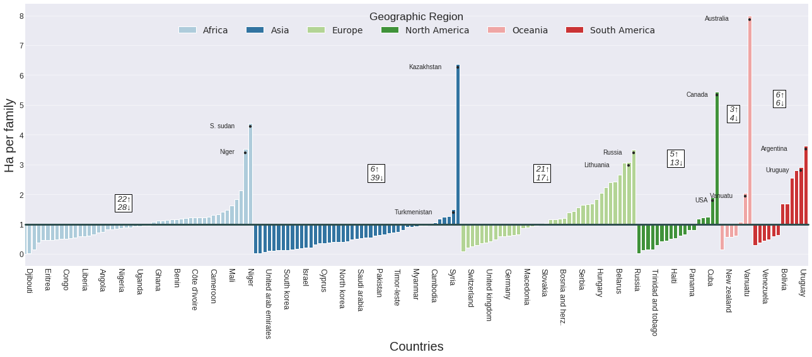
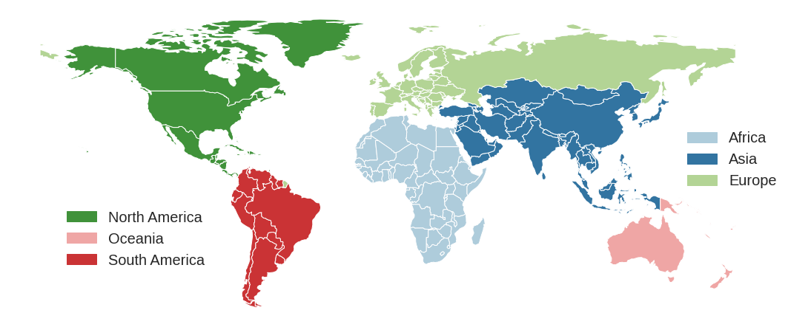
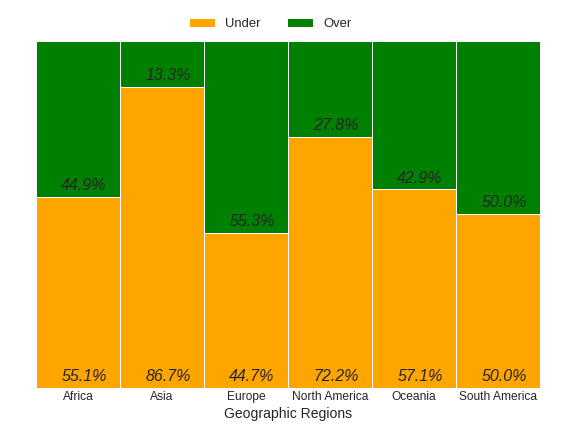

## Hectar per Person - Permaculture


- **Content**:
    - Objective
    - Initial considerations
    - Introduction
    - Theories
    - Question
    - Facts/ Current situation
    - Conclusions
  
- **Objectives**
    - To show the distribution of land suitable for cultivation, according to the data taken from the UN data bases (United Nations).
    - To use the Python libraries for handle/shape/extract/order the correspondent data used for this study.

- **Initial considerations**
    - Some missing data was taken from the FAO (Food and Agriculture Organism); and was estimated from general values that mixed Cultivated Lands and Permanent Crops.
    - The land is classified in four groups, however some of them could be intersected. For the purpose of this study this is not considered. Each group is taken as independent of any other.
    - There is neither is considered the seas spaces and the permanent pastures, so keep in mind that food generated by the fisher activities and permanent grazing land are not taken into account.
    - Since the objective of the study is to use the python tools, it is HIGHLY RECOMMENDED to search the studies made by the FAO in order to understand better and get deep into the subject. [FAO](http://www.fao.org/home/en/)
    
    
- **Introduction**
    - The UN (United Nations) classifies the lands in five types:


Table 1. Lands division.
<table>
<tbody style="border: 0px">
<tr><td><a href="http://www.fao.org/ag/agn/nutrition/Indicatorsfiles/Agriculture.pdf">Refence of this table</a>
</td><td>Graphically, the distribution of this lands previously classified is showed in percentage at the image below:</td></tr>
</tbody>
</table>


As shown, the less proportions of lands are validated (in statistics) for planting or pasture purposes: AL (Arable Lands) and PC (Permanent Crops); and a significant part of the land is already classified as FC (Forrest Cover) and IB (Important sites for terrestrial biodiversity protected). These last two could ensure the protection of the natural water sources and the variety of living species.


- **Theories**

There are theories that estimate the quantity of land used/needed (to meet their nutritional needs) per habitant, <br>as is summarized in this table:

<table>
<tbody style="border: 0px">
<tr><td>Table 2. Land use theories.<a href="https://www.primalsurvivor.net/much-land-need-self-sufficient/">Refence of this table</a>
</td>
<td><div style='text-align:justify'>The Permaculture Theory was chosen for this study to analyze the land's capacity to regenerate for more efficient use.<br>1(One) Hectare for a family of four means that this system is designed <b>to be performed by a group of persons</b>, not in an individual level. 
There is a lot of information about it in internet that explain this technique,<a href="https://en.wikipedia.org/wiki/Permaculture"> this for example</a>
</div></td></tr>
</tbody>
</table>

- **Question**
    
```diff
- How much land suitable for cultivation (CL) do we actually have in the Earth per human being?
```    

This mean, if we divide the quantity of Land suitable for cultivation and grazing, with the total world population, how much land do we have?

For this, we defined three main indicators:
|Indicator|Meaning|Equation|
|:----|:-----|:-----|
| 1 *Cultivables Lands (CL)*|Lands **already** intended to be <br>planted and doing grazing.||
| 2 *Permaculture Indicator (Perm_ind)*| Minimun amount of land needed <br>per family. **It's a fixed value.**||
| 3 *Hectares per Family (HpF)*| Calculated CL land per family ||

- **The facts**  
    
    The data about population and geographic coordenates is taken from the [geopandas](https://geopandas.org/) library wich is already classified by geographic region and country. <br> On the other hand, the data about lands was taken and processed from the United Nations tatistics database [UNstatistics](https://data.un.org/).
    
    Let’s begin with the general facts.

Table 3. Indicators.
    
|About Population|About CL|Permaculture Indicator (Perm_ind)|
|:--------:|:---------:|:---------:|
|**There are aprox. <code style="color:red">1.8</code> milliards of <br>families in the whole world**.|**There are <code style="color:red">1.6</code> milliards of hectares of Cultivable Lands.**|**There are <code style="color:red">0.87</code> Ha per Famlily in average, <br>that's means <code style="color:red">0.13</code> Ha under the Perm_ind.**|
|The world population is about seven milliards<br> of people (7.354.181.594). Divided by families,<br> we'll obtain the stimated number of families in entire world: <br>|The absolutes values in thousand hectares of Cultivable Lands (CL) in the Earth are: <br><br><br>|In a world level, the quantity of Land per family in Hectares (HpF) is: <br>|

But is this regular in the whole world? We'll know the distribution of the land for every region /country of the world. 


Because every country has a different land area, the best way to compare this indicator between differents countries is to use the relative value of cultivable lands(CL); this means, the percentage of CL per country (CL%).
         
This percentage in the world is show as follows:

    
    
The bar indicator in the bottom of the graphic, shows the percentage related with a color in a range of them: as closer to a light yellow, less percentage of land is cultivated. In this case, the biggest value - a darkest red- is around 70%.
    
At first sight, there are a lot of european countries that has more than 30% of CL; some in Africa and Asia; and not too much in America. But the big part of them, has less that 20%.
    
In a close up, the darkers ones are Bangladesh, Moldova and Burundi (66.02%, 63.7% and 60.35%); and the lighters are Greenland, Djibouti and Oman, (0.001%, 0.08% and 0.3% respect.)

It's important to notice that the CL% of each country has no direct relation with the geographic region where they belong; even in countries that may have the same climate characteristics, this percentage could strongly variate. Therefore, it'll be neccessary to search more information about the specific political/economical/historic situation of every country for probably understand this differences; out of the objective of this abstract.
    
But knowing the country percentage CL takes meaning only if it’s related with the population.

As we know, the population distribution has no relation with the area of the country. This means, the density of the population could totally differ in countries with the same area.

Let’s see how is this distribution per country/region.


    


In the left histogram it is showed that are 151 countries whose population is at maximum 1% of the world population (doesn't mean that the distribution is uniform in this 151 countries). Hence, there are just 19 countries that are heavily populated in comparison (table I for reference, anex.)

Analogously, the right histogram shows the CL distribution per country. The rough numbers show that 146 countries have at maximum 1 Hectare per every 3 families. In general numbers, this is 2/3 less that the minimun needs (for the Perm_indicator). Like in the left histogram, this distribution is not steady in this red bar of 146 countries.

If we zoom in the 146 countries (down histogram), we see that just 63 countries in the world are under the limit of the Perm_ind: at maximum 1 family per Hectare. In terms of percentage, this means that just the 37% have the minimum land needed to satisfy their nutritional needs, according to the Permaculture theory.



Finally, it's exposed the CL distribution per geographic region and per country.

In the next graphic, countries per region are showed through a barplot. For each region – represented by differents colors -  there are bars over and under the **'y'** axis reference : 1 Ha (Perm_ind).

All the countries that are over the reference, have 1 or more Ha per family. This means, for example, South Sudan (S.Sudan, bars in light blue first to the left) has a bit more than 4 Ha per family; Niger and Russia are over the 3.

Additionally,  a small square per region is added with two numbers. This is the quantity of countries over (up-arrow) and under (down-arrow) this reference, per region.


As it's seen in this last histogram, there are 63 countries over the reference. The higher value is in Oceania by Australia, that has almost 8 HpF; followed by Kasakhstan with a bit more than 6 HpF. As we can see, there is no regular distribution by geographic region.

The values under the 1Ha reference, means the quantity of land per country needed to reach the Perm_ind.


<table>
<tbody>
<tr style='background-color:white'><td style="text-align:justify; font-size:14px; line-height: 1.5em">Let's further specified the geographics regions. They're pretty similar to the 'Continents' division, except that the American continent is divided in two regions, North and South America; being the south limit after and including Colombia.
    
<br>On the barplot, Europe and South America are the regions that have more than half of their countries with enough HpF (table 2). And the region that has less countries (in proportion) under the Perm_ind is Asia.</td>
<td></td></tr>
</tbody>
/table>

The next stacked barplot will help us to see the percentage of countries related to the Perm_ind, divided by Geographic Region. 

<table>
<tbody>
<tr style='background-color:white'><td></td><td style="text-align:justify; font-size:14px; line-height: 1.5em">The values in green means the percentage of countries that has more than 1 HpF; in orange, less. As we can see, there are just two regions that are over (or equal) to this value: South America (50%) and Europe (55.3%).
Followed by Africa, Oceania, North America and finally Asia.


<br>

- <b>Conclusions</b>:
    - As it was exposed, it was found that the world needs 0.13 HpF to reach the minimun according to the chossen theory. This is equivalent to . If we know that the total earth land is , this missing value represent just the <code style="color:red">1.8%</code> of the earth land surface.</td>
</tr>
</tbody>
</table>

   - From the data, there is just 78% of the land classified (AL – 11%, PC – 1.27%, FC - 30.65% and IB - 35.11%). Theorically, it’ll be possible to take the 1.8% missing land from this 22% of unclassified land. We cannot forget the urban development; but according to differents sources (f. ex.,[ourworldindata.org](https://ourworldindata.org/urbanization), [newgeography.com](https://www.newgeography.com/content/001689-how-much-world-covered-cities)), there is no more that 2.7% of the earth land used for it. Hence, noticing this last value, there will be still around 19% of land unclassified.

   - It’s necessary to remember that the colored barplot represent the HpF per country. It was made to have a quantitative value of this indicator per country, by region; but is not usefull for compare it between countries, as there is no relation of population or lands between differents countries.

   - There are many others factors involved in the CL assing for every country that are not contemplate in this abstract, like seasonal variation due geographic location, geopolitical history… etc.


```python

```
