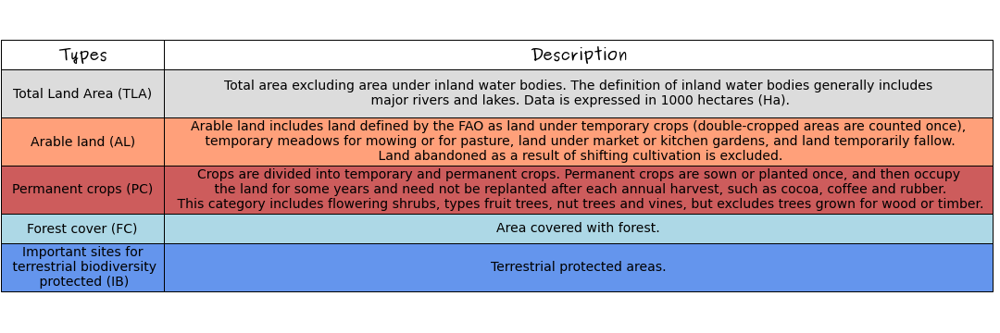
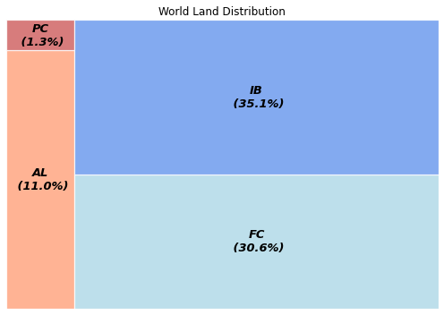
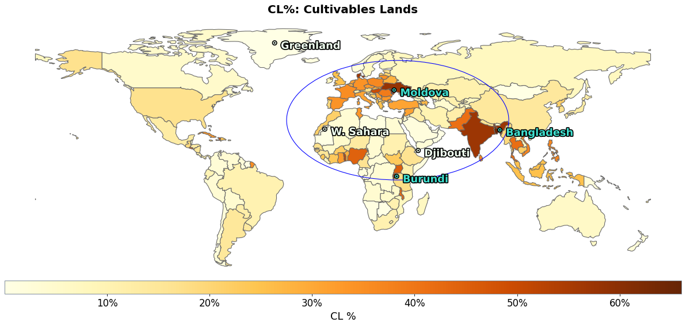
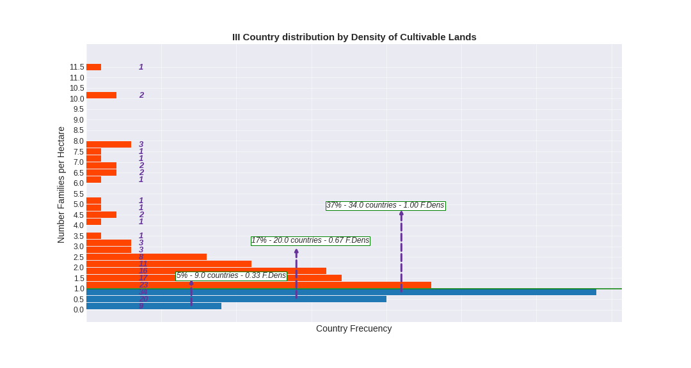
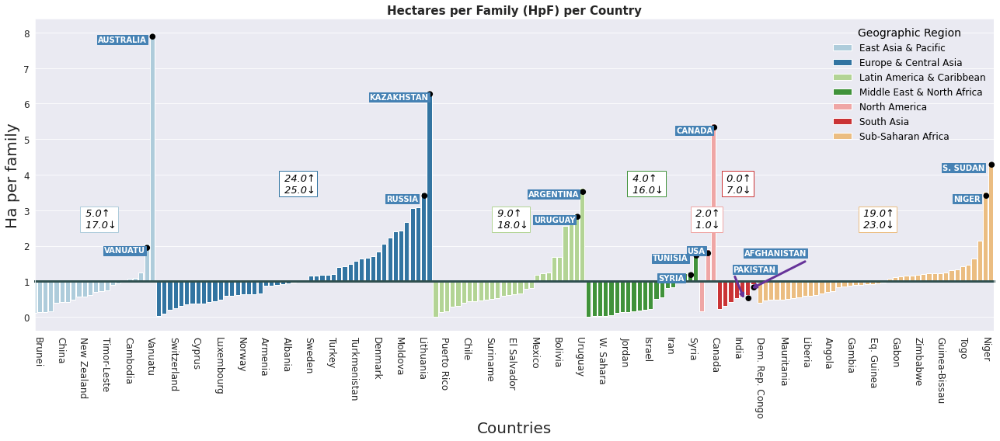

## Hectar per Person - Permaculture


- **Content**:
    - Objective
    - Preliminary considerations
    - Introduction
    - Theories
    - Question
    - Facts
        - Cultivable Land (CL) Distribution per country.
        - Population Density and Cultivable Land Density.
        - Hectare per Family and Perm_indicator per geographic region.
        
    - Conclusions
  
- **Objectives**
    - Show the distribution of land suitable for cultivation (CL), according to the data taken from the [UN Data Bases](https://data.un.org/) (United Nations records); using the latitud and longitud data of the countries listed in the geopandas library.
    - Use the Python libraries for handle/shape/extract/order the correspondent data used for this study.

- **Preliminary considerations**
    - The study takes into account the data of 170 countries. The rest of them were neglected since there is not enough statistic data.
    - Missing data from the UN records was taken from the FAO (Food and Agriculture Organism); and therefore calculated (p.ex. percentages values) from complementary values for indicators defined in this study.
    - The land is classified in four groups, and some of them could be intersected. For the purpose of this study this is not considered. Each group is independent of any other.
    - This study neglects any food that could be obtained from permanent pastures and waterbodies present in an inland surface, like lakes, ponds or rivers. Hence, fishing activities and permanent grazing has not been taken into account.
    - Since the main objective of the study is to show the graphic benefits and possible analyzes using python tools, it is recommended to review other assessments performed by the FAO in order to acquire a better understanding of the subject. [FAO](http://www.fao.org/home/en/)
    
- **Introduction**
    - The UN (United Nations) classifies the lands in five types:


Table 1. Lands classification.
<br><a href="http://www.fao.org/ag/agn/nutrition/Indicatorsfiles/Agriculture.pdf">Refence of this table and<a href="code_images/desc_table.ipynb"> it's code</a>



Figure I. Percentage Land Distribution
<br><a href="code_images/squari_dist.ipynb" target="_blank">(code of the image)</a>
    
<table>
<tbody style="border: 0px"><tr><td font-size='2em'></td><td style="font-size:13px; line-height: 1.6; text-align: justify;">Graphically, the distribution of this lands previously classified is showed in percentage (left graphic). 
    
<br>As shown, AL plus PC represent the 12,3 % of the world land distribution; while the FC and IB represent the 65.7%. 

<br>These last two could ensure the protection of natural water sources and the biodiversity within. As evidenced, there is 22% of the land surface not classified in the records and that will be mentioned later.</td></tr></tbody></table>


- **Theories**

There are theories that estimate the quantity of land used/needed (to meet their nutritional needs) per habitant, as is summarized in this table :

Table 2. Land use theories.
<br><a href="https://www.primalsurvivor.net/much-land-need-self-sufficient/">Refence of this table</a>
<br><a href="code_images/org_table.ipynb" target="_blank">(code of the table)</a>
<table>
<tbody style="border: 0px">
<tr><td> 
</td>
<td style="font-size:13px; line-height: 1.6; text-align: justify;"> The <b>Permaculture Theory</b> was chosen for this study to analyze the land's capacity to regenerate for more efficient use.
    
<br>1(One) Hectare for a family of four means that this system is designed <b>to be performed by a group of persons</b>, not in an individual level. 
There is a lot of information about it in internet that explain this technique,<a href="https://en.wikipedia.org/wiki/Permaculture"> this for example</a>
</td></tr>
</tbody>
</table>

- **Question**
    
```diff
- How much land suitable for cultivation (CL) do we actually have in the Earth per human being and how is it distributed?
```    

This mean, if we divide the quantity of Land suitable for cultivation and grazing, with the total world population, how much land do we have?

For this, we defined three main indicators created for this study:
<br>Table 3. Indicators.

|Indicator|Meaning|Equation|Variables|
|:----|:-----|:-----|:-----:|
| 1 *Cultivables Lands (CL)*|Lands **already** intended to be <br>planted and doing grazing.||Where<br> AL: Arable Lands <br>PC: Permanents Crops|
| 2 *Permaculture Indicator (Perm_ind)*| Minimun amount of land needed <br>per family. **It's a fix value.**||Ha (acronym for Hectare),<br> and it's a constant fixed reference value.|
| 3 *Hectares per Family (HpF)*| Calculated CL land per family ||Where <br>CL: Cultivables Lands. <br>Family: group of 4 people.|

- **The facts**  
    
The data about population and geographic coordenates is taken from the [geopandas](https://geopandas.org/) library wich is already classified by geographic region and country. <br>The data about land distributions was taken and processed from the United Nations statistics database [UNstatistics](https://data.un.org/).
<br>And the data of the geographic world regions is taken from the [Cartopy pakages](https://scitools.org.uk/cartopy/docs/latest/).

In the next table, there are showed the previous indicators for the whole world.

Table 4. Indicator values.
    
|About Population|About CL|Permaculture Indicator (Perm_ind)|
|:--------:|:---------:|:---------:|
|**There are aprox. <code style="color:red">1.8</code> milliards of <br>families in the whole world**.|**There are <code style="color:red">1.6</code> milliards of hectares of <br>Cultivable Lands.**|**There are <code style="color:red">0.87</code> Ha per Famlily in average, that's means <code style="color:red">0.13</code> Ha under the Perm_ind.**|
|The world population is about seven milliards of people (7.354.181.594). Divided by families, we'll obtain<br> the stimated number of families (of 4) in entire world: <br>|The absolutes values in thousand hectares of Cultivable Lands (CL) in the Earth are: <br><br><br>|In a world level, the quantity of Land per family in Hectares (HpF) is: <br>|

<b>CL% Distribution per country.</b>

As it's predictable, this distribution varies for every world region and country. Since every country has a different land area, the best way to compare this indicator between differents countries is to use the relative value of cultivable lands(CL); this means, the percentage of CL per country (CL%), as it is shown in the next map.<a href="code_images/CL.ipynb" target="_blank">(code of the image)</a>

Figure II. World map of CL%.


    
    
The bar indicator in the bottom of the graphic, shows the percentage represented by a color: as closer to a light yellow, less percentage of land is cultivated. For this map, the biggest value - a darkest red- is around 65%.

Going into details, the darkers ones are Bangladesh, Moldova and Burundi (66.02%, 63.7% and 60.35%); and the lighters are Greenland, Djibouti and Oman, (0.001%, 0.08% and 0.3% respect.)
    
An overall view show us that:


<table>
<tbody>
<tr style='background-color:white'><td style="text-align:justify; font-size:14px; line-height: 1.5em">         
<br>- The big part of the countries are under 20% of the CL.(See the pie diagram to the right)
    
<br>- Countries with large territory (like China, Canada or Brasil) are around <br>or under 20% of CL too.

<br>- There is a huge region (Center of Africa, South of Europe and Est of Asia) <br>that has more countries with higher CL% values that the rest of the world, <br>highlighted with the blue ellipse.<a href="code_images/country_pie.ipynb" target="_blank">(code of the pie)</a></td><td style="text-align:left; font-size:14px; line-height: 1.5em"><br>Figure III. Cumuled countries per range of CL%.</td></tr>
</tbody>
</table>

It's important to notice that the CL% of each country has <b>no direct relation with the geographic region where they belong</b>; even in countries that may have the same climate characteristics, this percentage could strongly variate. Therefore, it'll be neccessary to search more information about the specific political/economical/historic situation of every country for probably understand this differences; out of the objective of this abstract.
    
But knowing the country percentage CL make sense only if it’s related with the population.

<b>Population Density and CL Density.</b>

As we know, there is a relation between the population and the land area of the country; and it's not a constant one. This means, the density of the population could totally differ in countries with the same area.
In the next histogram charts, this concept is applied to every country, but relative to the Cultivable Lands. 

In equation mode:

|Family Density|Family Density CL (Density CL)|
|:----:|:-----:|
| | |


Let’s see how is this distribution per country/region.

Figure IV. Density population and Density population respect to CL.
<br><a href="code_images/hist_dens.ipynb">(code of the histograms below)</a>


    


In both histograms, there is a green line at the Y-axis level of 1.

The Y-axis represents the Family density per Ha, and the X-axis the number of accumulate countries; then, the purple numbers over the bars are the number of countries for an specific 'y' range.

This means, that all the countries that are under the 1 Y-axis reference, has less that 1 family per Ha. According to the Permaculture Theory, this is the best case. As this indicator grows over 1, the CL land is not enough for the theory requirements.

In the case of the left histogram, this reference (1 Y-axis) is put in order to have an idea of the family density referenced to the entire land per country. In the right one, it has to be taken as the Perm_indicator, because the family density is calculated according the country Cultivable Lands.

Hence, for both histogram, it is noticed that:
<br>- In the left one, there are 161 countries under the 1 Y-axis reference. So, even if it's taken all the country land for Cultivable purposes, there are 9 countries heavely populated; that has not even 1 Ha per family. This 161 represent the 95% of the world countries.
<br>- From the right one, there are 63 countries that has no more than 1 family per CL in Hectare, this are 37% of the world countries.
<br>- It could be thought that there is enough land per country that could be used for Cultivable purposes, but it's important to have in mind that <b>it's impossible to use all the country land for Cultivable purpouses </b>for many reasons: p.ex. geographical ones (there are mountains, deserts, swamps that makes impossible to be used for this), there are urban areas and industries necessary to sustain the development of the country, etc.

Let's zoom in the 63 countries that are under the limit of the Perm_ind (histogram below of Family Density by CL).

Figure V. Density population of CL.
<br><a href="code_images/hist_dens_CL.ipynb" target="_blank">(code of the histogram below)</a>


From this we can see that:
- 9 countries (5% of the total country world) has max 0.33 Families per Ha. This means, that it would be possible to have two more families per Hectare that they have; as it's shown in the next figures.
    
    
- 20 countries (17%), between 0.33 and 0.67Ha; and finally 34 countries (37%), between 0.67Ha and 1Ha. 
- <b> Just 37% of the world countries has at least 1Ha per Family</b>.

<b>HpF and Perm_indicator per geographic region.</b>

<i>Note: Notice that HpF (Hectares per Family) is inversely proportional to CL Density (Families per Hectare).
The previous analysis was related to CL Density, from here on the main subject will be HpF.</i>

Next is exposed the HpF referenced to the Perm_indicator. This means, the Cultivable Lands per Family, referenced to 1Ha, distributed per geographic region and per country. 

For the next charts, the Geographic Region division will be used. This division groups the countries in 8 regions:

Figure VI. Regions World Map.
<table>
<tbody>
<tr style='background-color:white'><td style="text-align:justify; font-size:14px; line-height: 1.5em">         
<br>- Middle East & North Africa
<br>- Sub-Saharan Africa 
<br>- Latin America & Caribbean
<br>- North America
<br>- Europe & Central Asia
<br>- East Asia & Pacific
<br>- South Asia
<br>- Antarctica (neglected for this study)<a href="code_images/world_map_w.ipynb" target="_blank">(code of the map)</a></td>
<td></td></tr>
</tbody>
</table>

To show the HpF of every country per region, it's used a barplot. For each region – represented by differents colors -  there are bars over and under the y-axis reference : 1 Ha (Perm_ind).

All the countries that are over the reference, have 1 or more Ha per family. For example, Australia (bars in light blue first to the left) has a bit more than 8 Ha per family; Kazakhstan a bit more than 6, Canada and South Sudan (S. Sudhan) just over 5 and 4 respectively. 

Additionally,  a small square per region is added with two numbers. This is the quantity of countries over (up-arrow) and under (down-arrow) this reference, per region <a href="code_images/ha_ref_w.ipynb" target="_blank">(code of the barplot below)</a>.

<br>Figure VII. Hectare per Family (HpF) per country.



There are countries under and over the 1Ha. The ones that are over has more than the minimun land required to accomplish the theory; the others, are lacking lands.

From this last histogram, it's noticed that:
- Every region has a different behavior; there is no regular distribution by geographic region. 
- There are some region with nearly half of the countries over the Perm_ind, like Europe & Central Asia and Sub-Saharan Africa. But due to the fact that <b>all the countries of the same region doesn't have the same land area and neither the same population</b>, it has no sense to think about a land redistribution in order to make all the countries to reach the Perm_ind.
- The South Asia region has no countries over the 1 Ha reference.
- The higher value is in Australia, from Est Asia and Pacific, that has almost 8HpF. This region has the most noticeable difference between their countries.

The next stacked barplot will help us see the percentage of countries related to the Perm_ind, divided by Geographic Region.


<table>
<tbody>
<tr style='background-color:white'><td style="text-align:justify; font-size:14px; line-height: 1.5em">Figure IIX. Percentage distribution of HpF per region.
<br><a href="code_images/HpF_bars_w.ipynb" target="_blank">(code of the table below)</a>
</td><td style="text-align:justify; font-size:14px; line-height: 1.5em">The green bars represents the percentage of countries that has more than 1 HpF; in orange, less. As it is visible, most of them has less than the Permaculture requirement; there is just one region that is over to this value: North America. Europe & Central Asia and Sub-Saharan Africa has almost half of this countries over, followed in descending order by Latin America & Caribbean, East Asia & Pacific, Middle East & North Africa and finally South Asia.

<br>

- <b>Conclusions</b>:
    
    - How much land suitable for cultivation (CL) do we actually have in the Earth per human being?: 
        - 0.87 Hectare per Family.
    
    - Making a huge and general calculus, the world needs 0.13 HpF to reach the minimun amount of CL according to the chosen theory. This is equivalent to 
    - If we know that the total earth land is  This missing value represent just the <code style="color:red">1.8%</code> of the earth land surface.</td>
</tr>
</tbody>
</table>

   - From the data, there is just 78% of the land classified (AL – 11%, PC – 1.3%, FC - 30.6% and IB - 35.1%). Theorically, it’ll be possible to take the 1.8% missing land from this 22% of unclassified land. We cannot forget the urban development; but according to differents sources (f. ex.,[ourworldindata.org](https://ourworldindata.org/urbanization), [newgeography.com](https://www.newgeography.com/content/001689-how-much-world-covered-cities)), there is no more that 2.7% of the earth land used for it. Hence, noticing this last value, there will be still around 19% of unclassified land.
       
   - There are many others factors involved in the CL assigned for every country that are not contemplated in this abstract, like seasonal variation due to geographic location, geographic topology … etc. All this conditions are possible subjects for future studies.
   
   - It would be useful to know if it's possible, per region, to reach the Perm_indicator by land redistribution. But without it, it could be possible to consider the world as an unity, that can distribute its resources equitably, with no need of territorial reordering.

